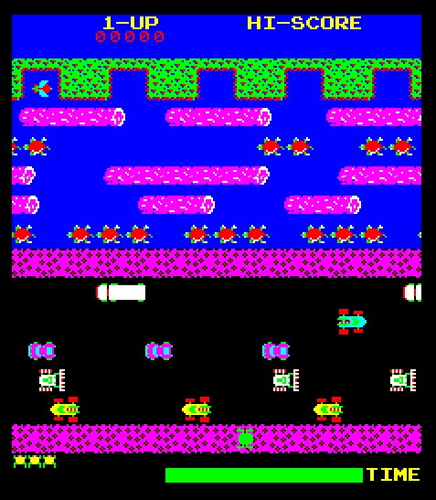

# Merfys Arcade Game

## Table of Contents

- [Intro](#intro)
- [History](#history)
- [Instructions](#instructions)
- [Contributing](#contributing)
- [License](#license)

## Intro

This project is part of Udacity's FEND program and the starter code can be found in this repository. According to the instructions, the functions for this project should be object-oriented functions (either class functions or class prototype functions) and the keyword `this` should be used appropriately inside the code, so to refer to the object the function is called upon.

## History

Frogger is a classic arcade game that was developed in 1981 by Konami and was distributed by Sega. It is one of the most recognizable classic arcade games of the 80's, which was considered as the golden age of the arcade games.

Frogger game screenshot [_(Image source: BBC Games Archive)_](http://bbcmicro.co.uk/game.php?id=1934)

The purpose of the original game was to direct the frogs to their homes, through a busy road and a hazardous river. Throughout the years, various clones of Frogger were developed, for almost every available platform and operating system. 

Worth mentioning also, is the characteristic music of the game, which is still recognizable after all these years.

[_(History source: Wikipedia)_](https://en.wikipedia.org/wiki/Frogger)

## Instructions

Use this [rubric](https://review.udacity.com/#!/rubrics/2013/view) for self-checking your submission.

### How to Run the game

Make sure the functions you write are **object-oriented** - either class functions (like `Player` and `Enemy`) or class prototype functions such as `Enemy.prototype.checkCollisions`. Also make sure that the keyword `this` is used appropriately within your class and class prototype functions to refer to the object the function is called upon.

### How to Play the game

Your **README.md** file should be updated with instructions on both how to 1. Run and 2. Play your arcade game.

For detailed instructions on how to get started, check out this [guide](https://docs.google.com/document/d/1v01aScPjSWCCWQLIpFqvg3-vXLH2e8_SZQKC8jNO0Dc/pub?embedded=true).

## Contributing

This repository is the starter code for _all_ Udacity students. Therefore, we most likely will not accept pull requests.

## License

