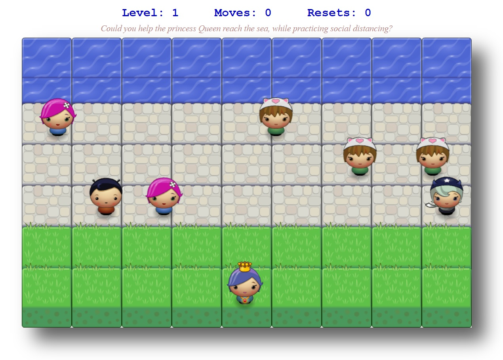

# Merfys Frogger Game

## Table of Contents

- [Intro](#intro)
- [History](#history)
- [How to Run the game](#how-to-run-the-game)
- [How to Play the game](#how-to-play-the-game)
- [Dependencies](#dependencies)
- [License](#license)

## Intro

This project, which is called **"Classic Arcade Game Clone Project"** has been part of Udacity's FEND program and the starter code can be found in this [repository](https://github.com/udacity/frontend-nanodegree-arcade-game).  

According to the instructions, the functions written for this project, should be **object-oriented** - either class functions (like `Player` and `People`) or class prototype functions such as `People.prototype.checkCollisions`. Also, the keyword `this` should be used appropriately within the class and class prototype functions to refer to the object the function is called upon.

## History

Frogger is a classic arcade game that was developed in 1981 by Konami and was distributed by Sega. It is one of the most recognizable classic arcade games of the 80's, which was considered as the golden age of the arcade games.

  
**Frogger game screenshot** [_(Image source: BBC Games Archive)_](http://bbcmicro.co.uk/game.php?id=1934)

The purpose of the original game was to direct the frogs to their homes, through a busy road and a hazardous river. Throughout the years, various clones of Frogger were developed, for almost every available platform and operating system. 

Worth mentioning also, is the characteristic music of the game, which is still recognizable after all these years.

[_(History source: Wikipedia)_](https://en.wikipedia.org/wiki/Frogger)

### How to Run the game

In order to run this game, you should download the zip file containing all the necessary files. After decompressing the zip file, you just need to run the **index.html** in order to play the game.

All the necessary files are contained in that folder, and thus, no internet connection is needed in order to run this game.

Keep in mind though that this game can only be played on computers with a physical keyboard, as you need the keyboard arrows in order to navigate the player during the game.

### How to Play the game

Below you can see a screenshot of this game and as you can notice, it is a slightly different version than the classical frogger game where there are always enemies around.

Instead, in this version, there are only friendly people walking next to the sea and the purpose of the game is to help the player, which incidentally is a princess called Queen, to reach the sea while practicing social distancing.

The game has three levels, with increasing difficulty, as the people in each new level walk faster than the previous level.

Thus, the purpose of the game is to complete all three levels, while using as few moves and as few restarts (resets) as possible.

## Dependencies  

The game uses the following files:  

- index.html

- _css/_
	- style.css

- _js/_
	- app.js
	- engine.js
	- resources.js

- _images/_
	- water-block-new.png
	- stone-block.png
	- grass-block.png
	- char-cat-girl.png
	- char-horn-girl.png
	- char-boy.png
	- char-pink-girl.png
	- char-princess-girl.png
  
- README.md
	- images/frogger-image.jpg
	- images/merfys-game.jpg

## License

Udacity's license can be read [here](License.md).
